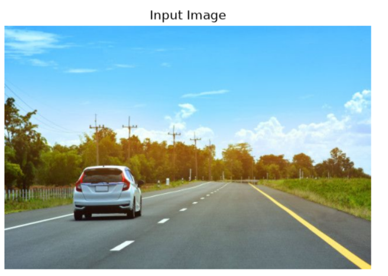
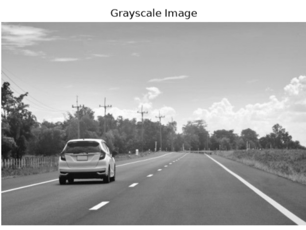
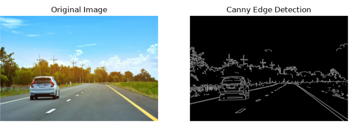
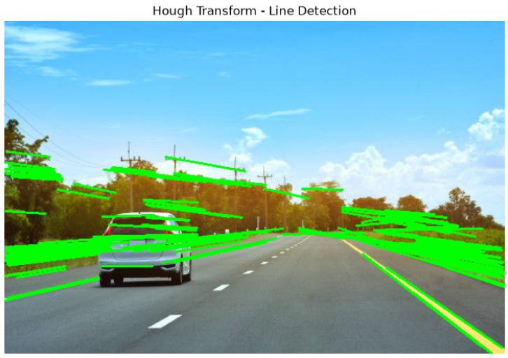

## Lane Detection
## Aim
To implement a basic lane detection pipeline using OpenCV by completing missing code segments at specified locations.

## Learning Objective
Understand each stage of image processing
Learn how to build a complete computer vision pipeline
Practice writing code in guided sections
Important Instruction: 👉 Write code ONLY in places marked as # Your Code Here 👉 Do NOT modify any other part of the code

## Software Used
Anaconda – Python 3.7
Jupyter Notebook / VS Code
OpenCV (cv2)
NumPy
Matplotlib
Algorithm:
# Step1:
Import all the necessary modules for the program.

# Step2:
Load a image using imread() from cv2 module.

# tep3:
Convert the image to grayscale.

# Step4:
Using Canny operator from cv2,detect the edges of the image.

# Step5:
Using the HoughLinesP(),detect line co-ordinates for every points in the images.Using For loop,draw the lines on the found co-ordinates.Display the image.

## Program
Developed By
Name: Vaishnavi.D
Register No: 212224220118

# Input image and grayscale image
```
import cv2
import numpy as np
import matplotlib.pyplot as plt
image = cv2.imread('Tiger.jpg')  # Replace with your image path
plt.imshow(cv2.cvtColor(image, cv2.COLOR_BGR2RGB))
plt.title('Input Image')
plt.axis('off')
```

```
gray_image = cv2.cvtColor(image, cv2.COLOR_BGR2GRAY)
plt.imshow(gray_image, cmap='gray')
plt.title('Grayscale Image')
plt.axis('off')
```

# Canny Edge detector output
```
import cv2
import numpy as np
import matplotlib.pyplot as plt

# Step 1: Load the image
image = cv2.imread('Tiger.png')

# Step 2: Check if image is loaded
if image is None:
    print("Error: Image not found. Check the file name/path.")
else:
    # Step 3: Convert image to grayscale
    gray = cv2.cvtColor(image, cv2.COLOR_BGR2GRAY)

    # Step 4: Apply Canny Edge Detection
    edges = cv2.Canny(gray, 100, 200)

    # Step 5: Display original image
    plt.figure(figsize=(10, 5))

    plt.subplot(1, 2, 1)
    plt.imshow(cv2.cvtColor(image, cv2.COLOR_BGR2RGB))
    plt.title('Original Image')
    plt.axis('off')

    # Step 6: Display Canny edges
    plt.subplot(1, 2, 2)
    plt.imshow(edges, cmap='gray')
    plt.title('Canny Edge Detection')
    plt.axis('off')

    plt.show()
```
    

# Display the result of Hough transform
```
import cv2
import numpy as np
import matplotlib.pyplot as plt

# Load image
image = cv2.imread('Tiger.png')

if image is None:
    print("Error: Image not found. Check the file name.")
else:
    # Convert to grayscale
    gray = cv2.cvtColor(image, cv2.COLOR_BGR2GRAY)

    # Detect edges
    edges = cv2.Canny(gray, 50, 150)

    # Hough Line Transform
    lines = cv2.HoughLinesP(
        edges,
        1,
        np.pi / 180,
        threshold=100,
        minLineLength=50,
        maxLineGap=10
    )

    # Copy image
    output_image = image.copy()

    # Draw detected lines
    if lines is not None:
        for line in lines:
            # Convert line to a 1D array
            line = np.array(line).flatten()

            # Make sure there are 4 values
            if len(line) == 4:
                x1, y1, x2, y2 = line

                cv2.line(
                    output_image,
                    (int(x1), int(y1)),
                    (int(x2), int(y2)),
                    (0, 255, 0),
                    2
                )

    # Display result
    plt.figure(figsize=(10, 6))
    plt.imshow(cv2.cvtColor(output_image, cv2.COLOR_BGR2RGB))
    plt.title('Hough Transform - Line Detection')
    plt.axis('off')
    plt.show()
```

## Result
Thus, the lane detection pipeline is successfully implemented by completing the missing code sections. The system detects and highlights lane lines effectively.